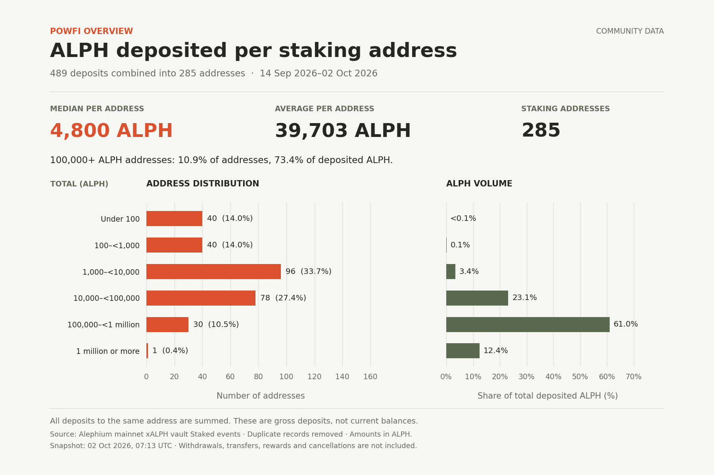

# Staking distribution image

The [distribution script](../../misc/scripts/staking-distribution.py) fetches PowFi
staking events and combines all deposits to the same recipient address into one
observation. It generates a shareable image without changing the dashboard.

## Setup

Use Python 3.10 or newer. Run these commands from the repository root:

```bash
python3 -m venv .venv
source .venv/bin/activate
python -m pip install -r misc/scripts/requirements-staking-distribution.txt
```

## Generate a fresh image

From the repository root, with the virtual environment activated:

```bash
python misc/scripts/staking-distribution.py
```

If your terminal is already in `output/staking-distribution`, run:

```bash
../../.venv/bin/python ../../misc/scripts/staking-distribution.py
```

Both commands fetch fresh events and save the results in this directory.

## Choose a fullnode

The default fullnode is `https://node.mainnet.alephium.org`. To use another node:

```bash
python misc/scripts/staking-distribution.py --fullnode http://127.0.0.1:12973
```

`--node-url` is an alias for `--fullnode`. The selected node must be synced to
Alephium mainnet and expose the vault's complete indexed contract-event history.
Pass its base URL without an `/events` suffix. The script assumes an API
accessible without authentication.

## Output files

- `powfi-deposit-distribution.png`: shareable 1800×1200 image.
- `powfi-deposit-distribution.svg`: scalable version.
- `summary.json`: statistics, distribution bins, snapshot date and methodology.
- `staking-events.json`: deduplicated source events.

Each run replaces these generated files and leaves this README intact. To keep
an earlier snapshot, select another output directory from the repository root:

```bash
python misc/scripts/staking-distribution.py --output-dir ./output/share
```

For all options, including replaying saved events offline:

```bash
python misc/scripts/staking-distribution.py --help
```

## What the chart measures

Repeated deposits to the same address are summed before calculating the mean,
median and distribution. For example, deposits of 100, 500 and 1,000 ALPH become
one address with 1,600 ALPH deposited.

These are cumulative gross deposits, not current balances. Withdrawals, xALPH
transfers, rewards and unstake cancellations are not added or subtracted. One
address does not necessarily represent one person.


